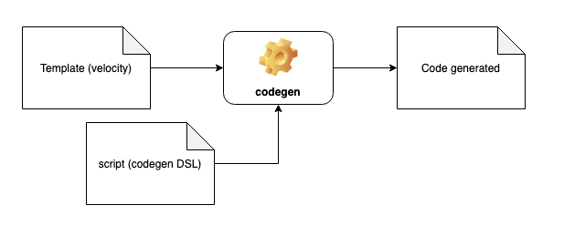

# Codegen

Codegen is a library for code generating from its own DSL (domain specific language). It receives files of scripts and templates (in velocity engine) as input and delivers the expected code on its output.



## How to use

Configure the dependency in the maven file.
```
<repository>
    <id>codegen</id>
    <url>https://raw.github.com/rdabotelho/mvn-repo/codegen/</url>
</repository>
```
```
<dependency>
    <groupId>com.m2r</groupId>
    <artifactId>codegen</artifactId>
    <version>1.0.0</version>
</dependency>
```

## Codegen DSL

To create scripts with your domains, codegen has its own DSL that allows the definition of classes, enums and relationships.

```
class User (label: 'User') {
    Long id;
    String name (label:'Name', length:'100');
    String login (label:'Login', length:'100');
    String password (label:'Password', length:'100', type: 'password');
    RoleEnum role;
    List<City> cities (label:'Cities', composition:'true', manyToMany: 'true', main:'true');
}

enum RoleEnum (fileName: 'Role.java') {
    ADMIN (id: '1', description: 'Administrator');
    USER (id: '2', description: 'User');
}

class City (label: 'City') {
    String name (label: 'Name');
    String state (label: 'State');
}
```

## Template velocity

To use codegen you need to create your generation templates using the [Apache Velocity](https://velocity.apache.org).

```
package com.m2r.boteutils.codegen.out;

class $domain.name {

#foreach( $attribute in $domain.attributes )
    private $attribute.type $attribute.name;
#end

#foreach( $attribute in $domain.attributes )
    public $attribute.type get${attribute.name.toPascalCase()}() {
        return $attribute.name;
    }

    public void set${attribute.name.toPascalCase()}($attribute.type id) {
        this.$attribute.name = $attribute.name;
    }

#end
}
```

## Codegen Engine

To code generation you need to configure your templates in the Template class and submit them in the codegen engine.

```
public class CodegenTest {

    @Test
    public void test() throws Exception {

        // define output dir
        File outputFile = new File(System.getProperty("java.io.tmpdir"), "/codegen-test");
        if (outputFile.exists()) {
            FileUtils.deleteDirectory(outputFile);
        }
        outputFile.mkdir();
        String outputDir = outputFile.getAbsolutePath();
        System.out.println("OUTPUT DIR: " + outputDir);
        
        // define input dir
        String inputDir = System.getProperty("user.dir") + "/src/test/java/com/m2r/codegen";
        
        // list of templates
        List<Template> templates = new ArrayList<>();
        
        // configuration of class template
        Template template = new Template();
        template.setName("Model");
        template.setScope("class");
        template.setDirectory(inputDir + "/template");
        template.setFileName("template-class.vm");
        template.setOutputDir(outputDir);
        template.setOutputFileName("out/${domain.name.toPascalCase()}.java");
        templates.add(template);
        
        // configuration of enum template
        template = new Template();
        template.setName("Enum");
        template.setScope("enum");
        template.setDirectory(inputDir + "/template");
        template.setFileName("template-enum.vm");
        template.setOutputDir(outputDir);
        template.setOutputFileName("out/${domain.name.toPascalCase()}.java");
        templates.add(template);
        
        // process the templates
        Codegen codegen = new Codegen();
        codegen.generate("teste", null, templates, new File(inputDir + "/script/script.txt"));
        
        assertTrue(new File(outputDir, "out/User.java").exists());
        assertTrue(new File(outputDir, "out/City.java").exists());
        assertTrue(new File(outputDir, "out/RoleEnum.java").exists());
    }
	
}
```

## Gencode DSL reference guide

###### 1 - Language syntax
```
class Name ([label|attrTitle|attrSubtitle|sections|searches|filteres|generations|formName]) {
    Type attribute ([label|length|transient|composition|manyToMany|manyToOne|main|section|input|multiple|mask|validators]);
    :
}

enum Name ([label]) {
    attribute (id,name,description);
    :
}
```

###### 2 - Allowed types:

- **Boolean:** Generates an entry type _BooleanInput_.

- ***Integer or Long:*** Generates an entry type _IntegerInput_.

- ***Float, Double or BigDecimal:*** Generates an entry type _DoubleInput_.

- ***LocalDate:*** Generates an entry type _DateTimeInput_.

- ***LocalDateTime:*** Generates an entry type _DateInput_.

- ***String:*** Generates an input type of _StringInput_.

- ***Model:*** Generates an entry type _ModelInput_.

- ***Enum:*** Generates an entry type _EnumInput_.

- ***List <_Model_>:*** Generates an entry type _ListInput_.

###### 3 - Parameters accepted in the definition of a class:

- ***label:*** Defines the label for an input.

- ***attrTitle:*** Defines the title for a view.

- ***attrSubtitle:*** Defines the subtitle for a view.

- ***sections:*** Defines a list with the sections of the class.

- ***searches:*** Defines a list of fields to search in _select-eager_ and _select-lazy_.

- ***filteres:*** Defines a list of fields for filters.

- ***generations:*** Defines a list of strategies, which can be defined by the user, for the generation (eg generations: ['model', 'controller', 'view']). If empty (generations: []) is entered, no file will be generated.

- ***formName:*** I define the name of the form. If not specified, the default value will be the model name.

###### 4 - Parameters accepted in the definition of a class attribute:

- ***label:*** Defines the label for an input.

- ***length:*** Defines the size of a field. The default value is _100_.

- ***transient:*** Defines whether the attribute is transient or not. The default value is _false_.

- ***composition:*** Defines whether the relationship is a composition. The default value is _false_.

- ***manyToMany:*** Defines a many to many relationship. The default value is _false_.

- ***manyToOne:*** Defines a many to one relationship. The default value is _false_.

- ***main:*** Defines who is the main in a bidirectional relationship. The default value is _false_.

- ***section:*** Defines which section the attribute belongs to. The index must conform to the class parameter _sections_ and the default value is _0_.

- ***input:*** Defines the type of input for forms:

- ***standard***: Standard input according to the attribute type (except _Domain_ e _List <Domain>_).

    - ***textarea***: Text entry with more than one line (only for _String_).

    - ***select-dropdown***: Standard input for simple choices (only for _Domain_).

    - ***select-eager***: Input for simple and multiple choices with the data initially loaded on the screen (only for _Domain_ e _List <Domain>_).

    - ***select-lazy***: Input for simple and multiple choices with data not initially loaded on the screen (only for _Domain_ e _List <Domain>_).
     
- ***multiple***: Defines whether the entry _select-eager_ or _select-lazy_ is multiple choice or not. Default _false_.

- ***mask***: Defines a type of mask, which can be used by the user, for the attributes (eg mask: 'money').

- ***validators***: Defines a list of validators, which can be defined by the user, for the attributes (eg validators: ['required', 'email']).

###### 5 - Parameters accepted in the definition of an enumeration:

- ***label:*** Defines the label for an input.

###### 6 - Parameters accepted when defining an attribute of an enumeration:

- ***id:*** Defines the value code.

- ***name:*** Defines the name of the value.

- ***description:*** Defines the description (label) of the value.

### Domain structure for making the templates

###### DomainList

Class that represents the context of the generation where all model classes and enumerations are defined in the script file.

```
class DomainList {

    StringWrapper projectName;
    List<Domain> domains;
    Domain getDomainByName(String name);
}
```

###### Domain

Class that represents a domain defined in the script file (class or enum).

```
class Domain {

    DomainList parent;
    StringWrapper type;
    StringWrapper name;
    List<DomainAttribute> attributes;
    Map<String, ParamValue> params;

    ParamValue getParam(String key);
    String ifParam(String name, String value, String text, String def);
    boolean isEnum();
    boolean isClass();
    DomainAttribute getAttributeByName(String name);
    StringWrapper getLabel();
    StringWrapper getAttrTitle();
    StringWrapper getAttrSubtitle();
    DomainAttribute getAttrTitleValue();
    DomainAttribute getAttrSubtitleValue();
    List<StringWrapper> getSections();
    List<StringWrapper> getSearches();
    List<StringWrapper> getFilteres();
    List<StringWrapper> getGenerations();
    Domain getCompositionOwner();
    boolean hasCompositionOwner();

}
```

###### DomainAttribute

Class that represents an attribute of a domain defined in the script file.

```
class DomainAttribute {

    // attributes
    Domain parent;
    StringWrapper type;
    StringWrapper name;
    Map<String, ParamValue> params;
    Domain typeDomain;
    String mappedBy;

    // basics methods
    ParamValue getParam(String key);
    boolean isFirst();
    boolean isLast();

    // helper methods to types
    boolean isBoolean();
    boolean isInteger;
    boolean isLong();
    boolean isDouble();
    boolean isFloat();
    boolean isBigDecimal();
    boolean isLocalDate();
    boolean isLocalDateTime();
    boolean isString;
    boolean isList();
    boolean isEnum();
    boolean isModel();
    boolean hasTypeDomain();
    boolean isMain();

    // helper methods to input type
    boolean isInput();
    boolean isStandardInput();
    boolean isTextareaInput();

    // helper methods to standard input types
    boolean isBooleanInput();
    boolean isIntegerInput();
    boolean isDoubleInput();
    boolean isDateTimeInput();
    boolean isDateInput();
    boolean isStringInput();
    boolean isModelInput();
    boolean isEnumInput();
    boolean isListInput();

    // helper methods to select input types
    boolean isSelectDropdownInput();
    boolean isSelectEagerInput();
    boolean isSelectLazyInput();
    boolean isMultiple();

    // helper methods to get class parameters
    StringWrapper getLabel();
    StringWrapper getLength();
    boolean isTransient();
    boolean isComposition();
    boolean isManyToMany();
    boolean isManyToOne();
    StringWrapper getSection();
    StringWrapper getInput();
    StringWrapper getMultiple();

    // helper methods to the velocity
    String ifFirst(String text, String def);
    String ifLast(String text, String def);
    String ifLast(String text, String def);
    String ifTransient(String text, String def);
    String ifComposition(String text, String def);
    String ifManyToMany(String text, String def);
    String ifManyToOne(String text, String def);
    String ifRequired(String text, String def);
    String ifLength(String text, String def);
    String ifParam(String name, String value, String text, String def);

    // helper methods to get enum parameters
    StringWrapper getId();
    StringWrapper getAttributeName();
    StringWrapper getDescription();

}
```

###### StringWrapper

Helper class to assist in the transformstion of string values.

```
class StringWrapper {

    // Gets the value without transformation.
    String getValue();

    // Transforms: NameAttribute -> nameAttribute.
    String toCamelCase();

    // Transforms: nameAttribute -> NameAttribute.
    String toPascalCase();

    // Transforms: nameAttribute -> name_attribute.
    String toSnakeLowerCase();

    // Transforms: nameAttribute -> Name_Attribute.
    String toSnakeUpperCase();

    // Transforms: nameAttribute -> name-attribute.
    String toKebabLowerCase();

    // Transforms: nameAttribute -> Name-Attribute.
    String toKebabUpperCase();

    // Transforms: NameAttribute -> nameattribute.
    String toLowerCase();

    // Transforms: NameAttribute -> NameAttribute.
    String toUpperCase();

}
```

###### ParamValue

Class that defined the value for each defined parameter.

```bash
class ParamValue {

    // Gets the value when it is a list of StringWrapper.
    List<StringWrapper> getValues();

    // Gets the value when it is a StringWrapper.
    StringWrapper getValue();

    // Gets the value when it is a StringWrapper with a default value.
    StringWrapper getValue(String def);

    // Checks whether a given value exists in the StringWrapper list.
    boolean hasValue(String value);

}
```